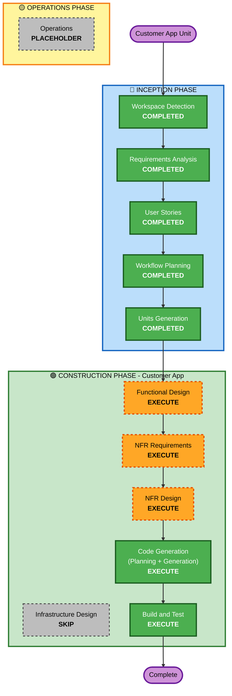

# Customer App (Unit 2) - Execution Plan

## 유닛 개요

| 항목 | 내용 |
|------|------|
| **유닛명** | Customer App |
| **기술 스택** | Vue.js 3 (Composition API) + TypeScript + Vite + Pinia |
| **역할** | 고객 주문 화면 (태블릿) |
| **디렉토리** | `frontend/customer/` |
| **담당 스토리** | 20개 (Feature 1~5, 9.2~9.3, 10 관련 UI) |

---

## 상세 분석 요약

### 변경 영향 평가
- **사용자 대면 변경**: Yes — 고객이 직접 사용하는 태블릿 주문 UI 전체
- **구조적 변경**: Yes — 새로운 Vue.js 앱 생성 (Greenfield)
- **데이터 모델 변경**: No — Backend API에서 제공하는 데이터 소비만 수행
- **API 변경**: No — Backend API 스펙을 소비하는 클라이언트 역할
- **NFR 영향**: Yes — 터치 친화적 UI, SSE 실시간 통신, 보안 토큰 관리, PBT 테스트

### 리스크 평가
- **리스크 수준**: Medium
- **롤백 복잡도**: Easy (독립적 프론트엔드 앱)
- **테스트 복잡도**: Moderate (SSE 실시간 통신, localStorage 상태 관리, PBT)

---

## Workflow Visualization

### Mermaid Diagram



### Text Alternative

```
Phase 1: INCEPTION (ALL COMPLETED)
  - Workspace Detection (COMPLETED)
  - Requirements Analysis (COMPLETED)
  - User Stories (COMPLETED)
  - Workflow Planning (COMPLETED)
  - Units Generation (COMPLETED)

Phase 2: CONSTRUCTION - Customer App
  - Functional Design (EXECUTE)
  - NFR Requirements (EXECUTE)
  - NFR Design (EXECUTE)
  - Infrastructure Design (SKIP)
  - Code Generation (EXECUTE)
  - Build and Test (EXECUTE)

Phase 3: OPERATIONS
  - Operations (PLACEHOLDER)
```

---

## Phases to Execute

### 🔵 INCEPTION PHASE
- [x] Workspace Detection (COMPLETED)
- [x] Requirements Analysis (COMPLETED)
- [x] User Stories (COMPLETED)
- [x] Workflow Planning (COMPLETED)
- [x] Units Generation (COMPLETED)

### 🟢 CONSTRUCTION PHASE — Customer App
- [ ] Functional Design - **EXECUTE**
  - **Rationale**: Customer App은 장바구니 상태 관리, SSE 이벤트 처리, 세션 라이프사이클 등 복잡한 프론트엔드 비즈니스 로직이 있음. 컴포넌트 구조, 상태 흐름, 라우팅 가드 등 상세 설계 필요.
- [ ] NFR Requirements - **EXECUTE**
  - **Rationale**: 터치 친화적 UI (44x44px), SSE 실시간 통신, localStorage 보안, PBT(fast-check) 테스트 전략 등 NFR 요구사항이 명확히 존재.
- [ ] NFR Design - **EXECUTE**
  - **Rationale**: NFR Requirements에서 도출된 패턴(SSE 재연결, 에러 바운더리, 접근성, PBT 적용 범위)을 구체적 설계로 반영 필요.
- [ ] Infrastructure Design - **SKIP**
  - **Rationale**: Customer App은 Vite로 빌드된 정적 파일을 Nginx Docker 컨테이너로 서빙하는 단순 구조. 별도 인프라 설계 불필요 (docker-compose.yml에서 이미 정의됨).
- [ ] Code Generation - **EXECUTE** (ALWAYS)
  - **Rationale**: Vue.js 앱 전체 구현 — 컴포넌트, 뷰, 스토어, 서비스, 라우터, 타입 정의, PBT 테스트 코드 생성.
- [ ] Build and Test - **EXECUTE** (ALWAYS)
  - **Rationale**: 빌드 검증, 단위 테스트(Vitest + fast-check), 통합 테스트 지침 생성.

### 🟡 OPERATIONS PHASE
- [ ] Operations - PLACEHOLDER
  - **Rationale**: 향후 배포 및 모니터링 워크플로우 (현재 미구현)

---

## Customer App 스토리 범위

### 담당 Feature 및 스토리

| Feature | 스토리 | 화면 | 핵심 로직 |
|---------|--------|------|-----------|
| Feature 1: 태블릿 자동 로그인 | US-1.1~1.5 | /setup | localStorage 인증, 토큰 관리 |
| Feature 2: 메뉴 조회 | US-2.1~2.5 | / | API 호출, 카테고리 탐색 |
| Feature 3: 장바구니 | US-3.1~3.7 | /cart | localStorage 상태 관리, 금액 계산 |
| Feature 4: 주문 생성 | US-4.1~4.5 | /order/* | API 호출, 중복 방지, 리다이렉트 |
| Feature 5: 주문 내역 | US-5.1~5.4 | /orders | SSE 실시간 업데이트, 재연결 |
| Feature 9: 엣지 케이스 | US-9.2, US-9.3 | 전체 | 동시 주문, 세션 종료 처리 |

### 크로스-유닛 의존성 (Backend API 필요)

| 스토리 | 의존 API | 설명 |
|--------|----------|------|
| US-1.1~1.3 | POST /api/table/auth | 테이블 인증 |
| US-2.1~2.3 | GET /api/menu, GET /api/menu/:categoryId | 메뉴 조회 |
| US-4.2~4.3 | POST /api/orders | 주문 생성 |
| US-5.1 | GET /api/orders | 주문 내역 조회 |
| US-5.2, US-5.4 | GET /api/sse/customer/:tableId | SSE 스트림 |

---

## 예상 타임라인

| 단계 | 예상 소요 |
|------|-----------|
| Functional Design | 1 interaction |
| NFR Requirements | 1 interaction |
| NFR Design | 1 interaction |
| Code Generation (Planning) | 1 interaction |
| Code Generation (Generation) | 2~3 interactions |
| Build and Test | 1 interaction |
| **합계** | **7~8 interactions** |

---

## 성공 기준

- **Primary Goal**: 고객이 태블릿에서 메뉴 조회, 장바구니 관리, 주문 생성, 주문 상태 확인을 할 수 있는 완전한 Vue.js 앱
- **Key Deliverables**:
  - Vue.js 3 프로젝트 구조 (Vite + TypeScript + Pinia)
  - 6개 화면 (setup, menu, cart, order confirm, order success, orders)
  - SSE 클라이언트 (실시간 주문 상태 + 세션 종료)
  - localStorage 기반 장바구니 및 인증 관리
  - PBT 테스트 (fast-check)
  - Dockerfile (Nginx 서빙)
- **Quality Gates**:
  - TypeScript 컴파일 에러 없음
  - Vitest 단위 테스트 통과
  - fast-check PBT 테스트 통과
  - 터치 친화적 UI (44x44px 최소 터치 영역)
  - SSE 재연결 로직 구현

---

## Extension Compliance

| Extension | Status | Rationale |
|-----------|--------|-----------|
| Security Baseline | Applicable | 토큰 저장, 입력값 검증, XSS 방지 |
| Property-Based Testing | Applicable | 장바구니 계산, 상태 전이, API 응답 파싱에 PBT 적용 |
